# Homework Service — System Architecture & Design

This document describes how the Learnairium Homework Help Service is built and
how a request flows through it. It complements the [README](../README.md) (setup,
configuration, API reference) with diagrams and the reasoning behind the design.

All diagrams are [Mermaid](https://mermaid.js.org/) and render natively on GitHub.
Everything below was derived from the code in this repository; file paths are given
so each claim can be checked.

## Contents

1. [Purpose and design principles](#1-purpose-and-design-principles)
2. [System context](#2-system-context)
3. [Component architecture](#3-component-architecture)
4. [Request pipeline](#4-request-pipeline)
5. [Flows](#5-flows)
   - [5.1 Image extraction](#51-image-extraction)
   - [5.2 Start a session](#52-start-a-session)
   - [5.3 Session actions](#53-session-actions)
   - [5.4 LLM call, validation and retry](#54-llm-call-validation-and-retry)
6. [Session lifecycle](#6-session-lifecycle)
7. [Data architecture](#7-data-architecture)
8. [LLM provider abstraction](#8-llm-provider-abstraction)
9. [Security model](#9-security-model)
10. [Failure handling](#10-failure-handling)
11. [Deployment](#11-deployment)
12. [Frontend](#12-frontend)
13. [Testing strategy](#13-testing-strategy)
14. [Key design decisions](#14-key-design-decisions)
15. [Observations from the code review](#15-observations-from-the-code-review)

---

## 1. Purpose and design principles

The service is a step-gated AI tutor. It **never hands the student the answer
directly**: it reveals one guided step at a time and only produces a final answer
on the last permitted step.

| Principle | How the code enforces it |
|---|---|
| **Step-gated** | `response_validator.py` strips `final_answer` unless `is_final_step` is true, and overrides `is_final_step` if it arrives before the last allowed step. |
| **Never fail the student** | `retry_handler.call_with_retry` never raises: two LLM attempts, then a canned fallback step. |
| **Tracking must not break tutoring** | `concept_tracker.record_concept` catches and logs every exception. |
| **Stateless service, external state** | All session state lives in Redis; nothing is kept in process memory except client handles and the JWKS cache. |
| **Provider-agnostic** | One `call_llm(messages)` seam; four providers selected by `LLM_PROVIDER`. |
| **Identity from the token** | The student ID is always taken from the verified JWT, never trusted from the request body. |

## 2. System context

The service is a standalone FastAPI microservice. It shares Cognito, Redis and RDS
with the main Learnairium platform, and is reached through the Spring Boot site,
which acts as a proxy (BFF).

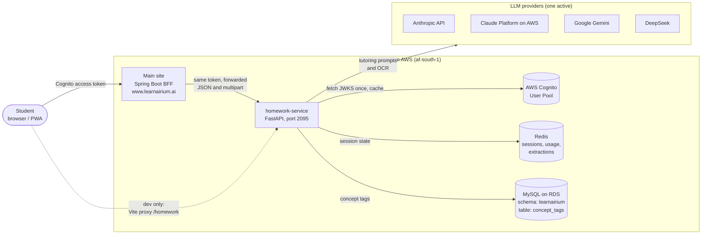

**Trust boundaries.** The main site and this service each validate the *same* Cognito
JWT independently, so no service-to-service credential is needed. The daily session
cap here (`DAILY_SESSION_LIMIT`) is a low-level abuse guard and is separate from any
subscription gating that Spring Boot applies.

> The Spring Boot proxy is not yet written (see README, *Known open items*). Until it
> exists, the React frontend calls this service directly.

## 3. Component architecture

The code is layered so that HTTP concerns, domain logic and infrastructure clients
don't leak into one another.

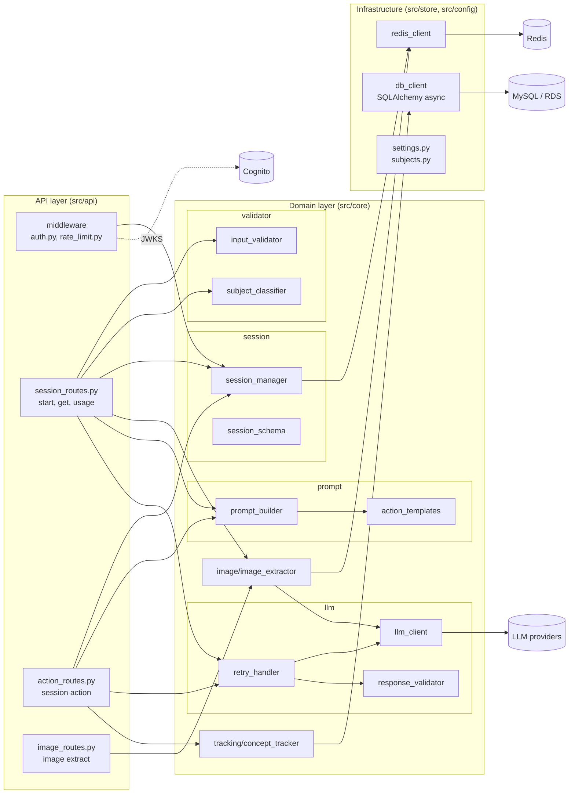

| Module | Responsibility |
|---|---|
| `main.py` | App factory, CORS, request-timing middleware, global 500 handler, `/health`, lifespan (Redis ping on start, close Redis and DB on stop). |
| `api/middleware/auth.py` | Bearer-token validation against Cognito JWKS (RS256); dev-token bypass in development. |
| `api/middleware/rate_limit.py` | FastAPI dependency enforcing the daily session cap (applied to `session/start` only). |
| `api/routes/*` | HTTP endpoints; orchestrate the domain modules. Routes hold the orchestration logic; there is no separate service layer. |
| `core/validator` | Sanitise and reject bad input; keyword-based subject classification. |
| `core/session` | `Session` model, Redis persistence, step/hint/skip counters, daily usage counter, ownership check. |
| `core/prompt` | Build the system + user prompt pair per action from subject-aware templates. |
| `core/llm` | Provider client, JSON response validation, retry-then-fallback. |
| `core/image` | OCR via a vision model, confidence scoring, one-time extraction tokens. |
| `core/tracking` | Write (and read) `concept_tags` rows with a computed struggle index. |
| `store` | Lazily created singletons for the Redis client and the async SQLAlchemy engine. |
| `config` | `Settings` (pydantic-settings, `.env`) and the `SUBJECTS` table. |

## 4. Request pipeline

Every request passes through the same outer shell; each endpoint then composes
its own dependencies.

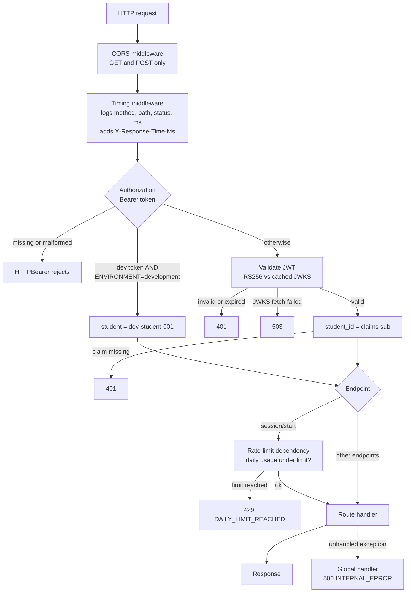

## 5. Flows

### 5.1 Image extraction

`POST /homework/image/extract` turns a photo into text and stops. The image is never
turned directly into a solution; the student must confirm or edit the text first.

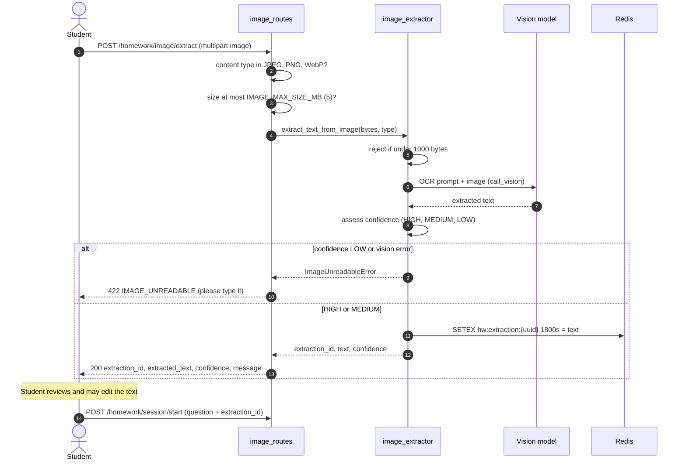

Confidence heuristic (`_assess_confidence`): under 10 characters, fewer than 3 words,
or 3+ `[unclear]` markers means **LOW** (rejected); any `[unclear]` or fewer than 8
words means **MEDIUM**; otherwise **HIGH**.

### 5.2 Start a session

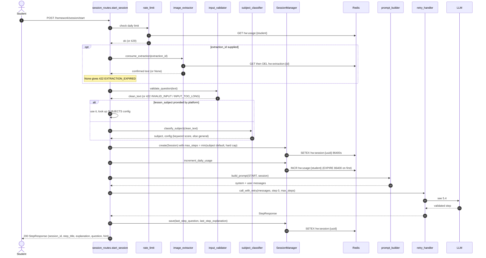

Note the ordering: the daily-usage counter is incremented *before* the LLM call, so a
session that ends in the fallback response still consumes one of the student's
sessions.

### 5.3 Session actions

`POST /homework/session/{id}/action` accepts four actions. All of them load the
session, check ownership, build a prompt, call the LLM through the retry handler,
and persist the result. They differ in what they do to session state.

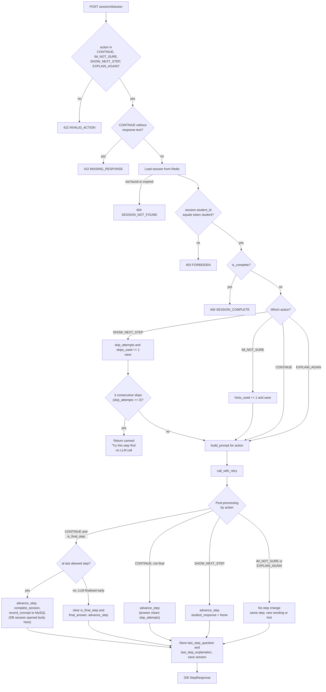

What each action means for the student and the data:

| Action | Requires | Advances step | Counters touched | Prompt template |
|---|---|---|---|---|
| `CONTINUE` | `response` text | Yes | resets `skip_attempts` to 0 | `continue_template` |
| `IM_NOT_SURE` | none | No | `hints_used` +1 | `im_not_sure_template` |
| `SHOW_NEXT_STEP` | none | Yes (unless guardrail) | `skip_attempts` +1, `skips_used` +1 | `show_next_step_template` |
| `EXPLAIN_AGAIN` | none | No | none | `explain_again_template` |

`START` is used internally by `session/start`. `FINALIZE` exists in `prompt_builder`
but no route currently calls it.

**Skip guardrail.** `skip_attempts` counts *consecutive* `SHOW_NEXT_STEP` presses and is
cleared only when the student actually answers (`CONTINUE`). On the third consecutive
skip the service returns a canned "Try this step first" response, makes no LLM call,
and does not advance; further skips stay blocked until the student answers.
`skips_used` is a separate lifetime total (every press, blocked or not) and is what
gets written to `concept_tags.skips_used`.

**Completion sequence** (the only place the database is written):

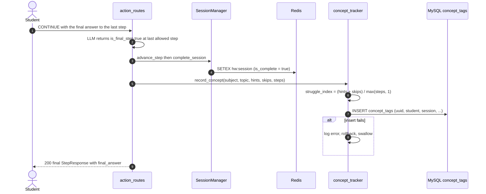

### 5.4 LLM call, validation and retry

This is the guardrail core. The LLM output is untrusted: it is parsed, checked
against six rules, sanitised where possible, retried once with a stricter prompt
where not, and replaced with a safe fallback if the second attempt also fails.

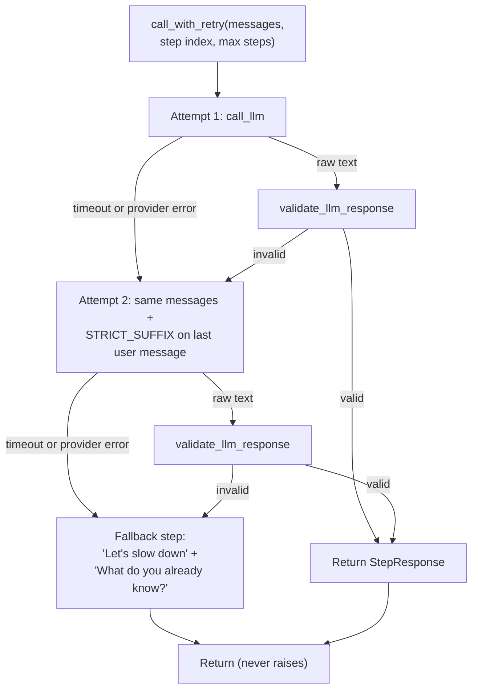

The six validation rules (`response_validator.py`). Rules marked **repair** fix the
response in place; rules marked **reject** trigger the retry.

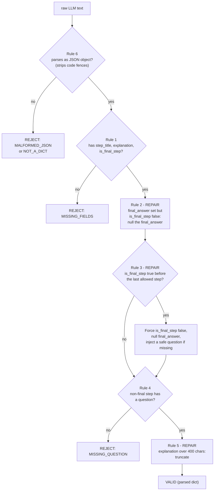

## 6. Session lifecycle

A session is a small JSON document in Redis. Its state changes only through
`SessionManager`.

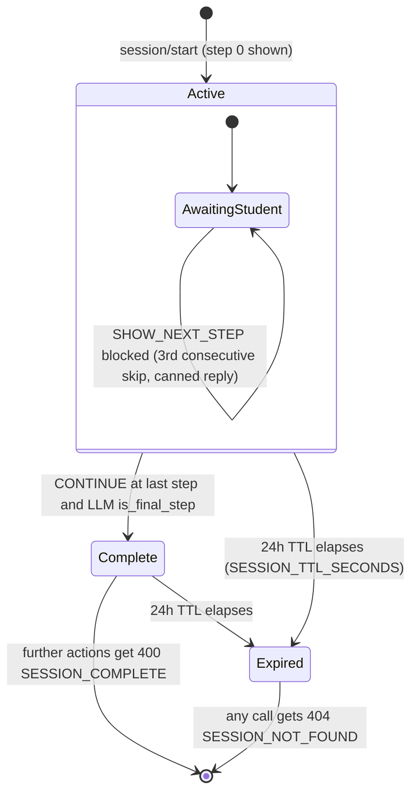

Step budget: `max_steps_allowed = min(subject.default_max_steps, MAX_STEPS_HARD_CAP)`.

| Subject | Default max steps | Chosen by |
|---|---|---|
| math | 5 | keyword score, or `lesson_subject` |
| science | 5 | keyword score, or `lesson_subject` |
| english | 4 | keyword score, or `lesson_subject` |
| history | 4 | keyword score, or `lesson_subject` |
| general | 4 | fallback when no keyword matches |

The hard cap is 7 (`MAX_STEPS_HARD_CAP`).

## 7. Data architecture

The service uses two stores with different jobs: Redis for short-lived, per-student
working state, and MySQL for the one durable record it produces.

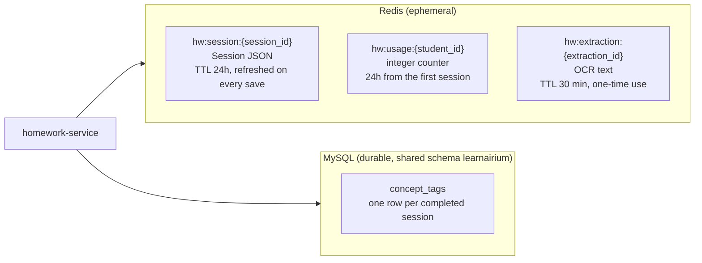

**Redis session document** (`Session` in `session_schema.py`):

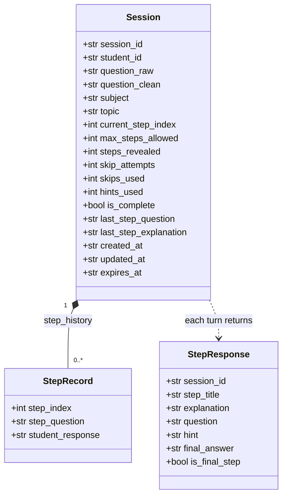

**MySQL table** (`migrations/create_concept_tags.sql`, mirrored by
`core/tracking/models.py`). It is a plain, unpartitioned table with no foreign keys,
because the student record lives in Cognito and the session in Redis.

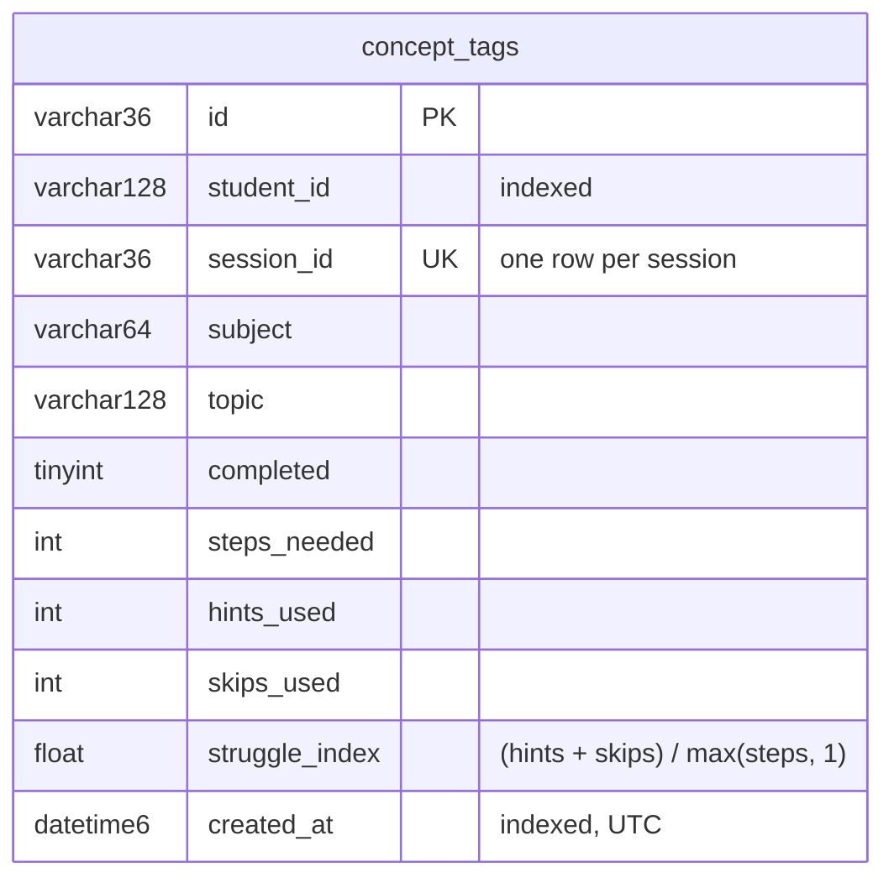

Indexes: `uq_session_id`, `idx_student_id`, `idx_subject_topic`,
`idx_student_subject`, `idx_created_at`. Two read helpers exist for a future teacher
dashboard, `get_student_concepts` and `get_weak_areas` (average struggle index at or
above a threshold), but no route uses them yet.

**Retention.** Redis data expires by TTL. `concept_tags` rows are never deleted;
a retention policy is an open Legal/Product decision (see README).

## 8. LLM provider abstraction

`call_llm(messages)` in `llm_client.py` is the only seam between the domain and a
model provider. Messages are always a `[system, user]` pair; `_split_system` moves
the system text into each provider's native system-prompt field.

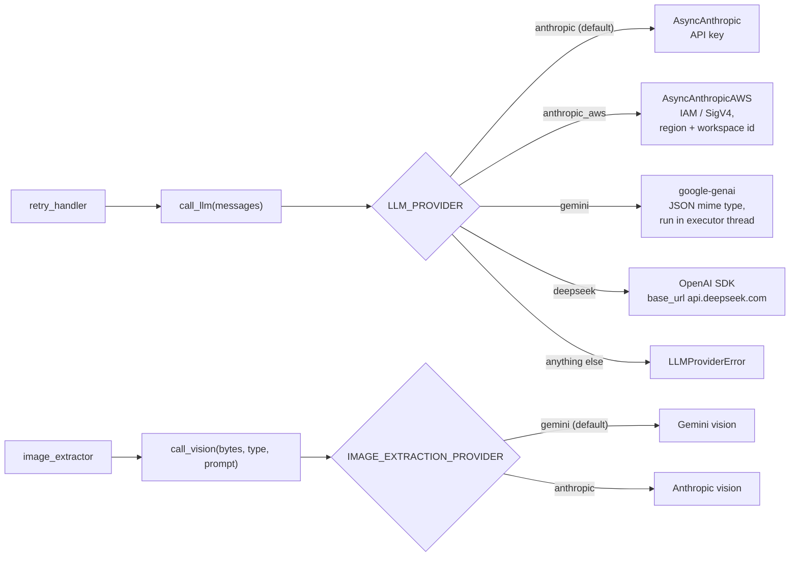

Text and vision providers are configured independently, so tutoring can run on one
provider while OCR runs on another. Provider clients are created lazily and cached
per process. Common call settings are `max_tokens=1000` (2000 for vision) and, for
DeepSeek and Gemini, `temperature=0.3`.

Data-residency note: for `anthropic_aws`, the workspace region only scopes IAM and
billing. It does not pin where inference runs, so it should not be treated as a
data-residency guarantee (POPIA). This is tracked in the README's open items.

## 9. Security model

| Concern | Control | Where |
|---|---|---|
| Authentication | Cognito JWT, RS256, verified against the pool's JWKS (fetched once, cached per process) | `auth.py` |
| Identity | `student_id` comes from the token claim (`STUDENT_ID_FIELD`, default `sub`); the `student_id` field in the request body is ignored | `auth.py`, `session_routes.py` |
| Authorisation | Every session read/action checks `session.student_id == token student`; `/usage/{id}` rejects other students' IDs | `session_manager.verify_ownership` |
| Abuse control | Daily session cap per student, default 5 | `rate_limit.py` |
| Prompt injection | Regex screen on input for known phrases; on match the student sees a generic "couldn't understand" message | `input_validator.py` |
| Input hygiene | HTML tags stripped, 5 to 2000 chars, needs 3+ letters, whitespace collapsed | `input_validator.py` |
| Output control | LLM JSON validated and repaired; step-gating enforced server-side, not by the prompt alone | `response_validator.py` |
| Image safety | Type allow-list (JPEG, PNG, WebP), 5 MB cap, image only ever becomes text for confirmation | `image_routes.py`, `image_extractor.py` |
| CORS | `*` in development; only `https://www.learnairium.ai` otherwise; GET and POST only | `main.py` |
| Docs exposure | `/docs` and `/redoc` disabled in production | `main.py` |
| Dev bypass | Hard-coded dev token accepted **only** when `ENVIRONMENT=development` | `auth.py` |
| Container | Non-root user, multi-stage build, healthcheck | `Dockerfile` |
| Secrets | `.env` is git-ignored; production S3/IAM access via the instance role, not static keys | `.gitignore`, README |

## 10. Failure handling

| Failure | Behaviour | Student sees |
|---|---|---|
| LLM timeout / provider error / malformed output | Retry once with stricter prompt, then canned fallback step | A gentle "Let's slow down" step, never an error |
| Concept-tag DB write fails | Logged, rolled back, swallowed | Nothing; the final answer is still returned |
| Redis unavailable at startup | Warning logged, service still starts | Requests needing Redis fail with 500 |
| Cognito JWKS unreachable | 503 "Auth service unavailable" | Error screen |
| Invalid or expired token | 401 | Error screen |
| Session expired or unknown | 404 `SESSION_NOT_FOUND` | "Your session has expired" |
| Extraction expired (over 30 min) | 422 `EXTRACTION_EXPIRED` | "Please upload the image again" |
| Daily limit reached | 429 `DAILY_LIMIT_REACHED` with usage counts | "Come back tomorrow" |
| Unhandled exception | Global handler logs stack trace, returns 500 `INTERNAL_ERROR` | Generic message |

## 11. Deployment

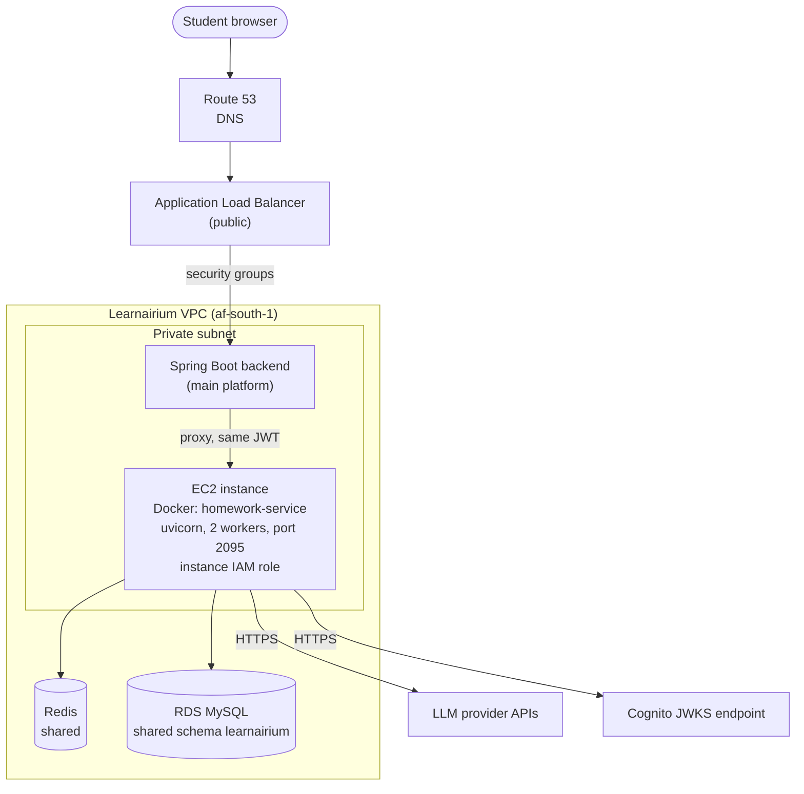

- **Image** (`Dockerfile`): Python 3.12-slim, multi-stage (dependencies built in a
  venv, copied into the runtime stage), runs as a non-root user, health check hits
  `/health` every 30 s.
- **Process model**: `uvicorn main:app --workers 2`. Because there are multiple
  worker processes, all shared state must be in Redis; the JWKS cache and provider
  clients are per-process.
- **Local development** (`docker-compose.yml`): the service, Redis 7 and MySQL 8
  (host port 3307, schema `learnairium`) with health-checked start-up ordering.
  The compose `environment:` block overrides `REDIS_URL` and `DATABASE_URL`.
- **Sizing note**: Spring Boot's `WebClient` timeout should exceed `LLM_TIMEOUT_MS`
  (15 s), since the LLM call is the slow path (a retry can double it).

## 12. Frontend

`homework-frontend/` is a React 18 + Vite + Tailwind single-page app that drives
the same four endpoints. In development, Vite proxies `/homework` to
`localhost:2095`, and `VITE_DEV_TOKEN` pairs with the backend's dev bypass.

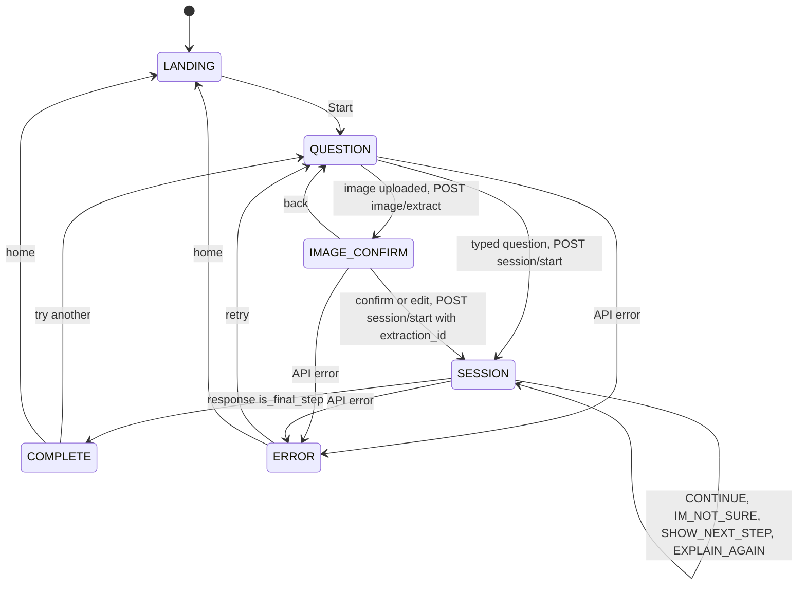

The API client (`src/services/homeworkApi.js`) resolves its token from
`VITE_DEV_TOKEN` first, then `localStorage['learnarium_token']`, and maps backend
errors (`detail.error`, `detail.message`) onto `Error.code` / `Error.message` for
the error screen. `mockApi.js` provides an offline stand-in.

## 13. Testing strategy

107 tests, none of which need real Redis, MySQL, Cognito or an LLM.

| Layer | Files | Focus |
|---|---|---|
| Unit | `tests/unit/test_*.py` | One module each: validators, classifier, prompt builder, response validator, retry handler, LLM client provider routing, session manager, image extractor, concept tracker |
| Integration | `tests/integration/test_*.py` | Full FastAPI request/response cycle: session flow, image flow, concept tracking |
| Isolation | `conftest.py` | Auto-overrides Cognito auth, the rate limiter, Redis and the DB session for every test |

## 14. Key design decisions

| Decision | Rationale | Trade-off |
|---|---|---|
| Separate Python microservice rather than a module in Spring Boot | Independent deploy and iteration on AI logic; Python's LLM ecosystem | An extra hop and an extra deployable |
| Spring Boot as BFF, same token forwarded | No new credential scheme; each side validates independently | The main site cannot reshape identity; both must trust one pool |
| Redis for session state, 24 h TTL | Fast, expiring, horizontally scalable across workers | Sessions are lost on Redis flush; no long-term history |
| MySQL only for completed-session tags | Durable data needed for future weak-area analytics; reuses shared RDS | Only completed sessions are recorded, so abandoned sessions leave no trace |
| Step-gating enforced in code, not only in the prompt | LLMs ignore instructions occasionally; the guarantee must be deterministic | Some LLM output is silently rewritten |
| Retry once, then fallback, never raise | A tutoring UI that errors mid-lesson is worse than a generic nudge | A persistent provider outage looks like a "slow down" step, not an outage; monitor logs |
| Provider seam with four backends | Cost, latency and residency choices can change without touching domain code | Behaviour differs slightly per provider (e.g. Gemini forces a JSON MIME type) |
| OCR then confirm, via a one-time token | Keeps the model from solving straight from a photo; lets the student fix OCR errors | An extra round trip and a 30-minute window |
| Fire-and-forget-style tracking (errors swallowed) | Analytics must never degrade tutoring | Silent data loss is possible; relies on log alerting |

## 15. Observations from the code review

These are things noticed while writing this document. They are stated as read from
the code and were **not** all exercised at runtime. The diagrams above show the code's
actual behaviour; each open item below is worth a decision.

**Resolved since this review was written**

- **Skip guardrail never triggered, and `concept_tags.skips_used` was always 0.**
  `advance_step` reset `skip_attempts` after every allowed skip, so consecutive skips
  never accumulated. Now only a real answer resets it, and a separate lifetime
  `skips_used` counter feeds concept tracking. Covered by regression tests in
  `test_session_manager.py`, `test_session_flow.py` and `test_concept_tracking.py`.
- **Every action request depended on the database.** `get_db_session` built the async
  engine on each action, so an empty or unreachable `DATABASE_URL` failed actions that
  never write. It now yields a `LazyDBSession` that opens a connection only on first
  use (`src/store/db_client.py`); a failed write is swallowed by `record_concept` as
  intended. Covered by `tests/unit/test_db_client.py`.

**Still open**

1. **The "fire-and-forget" tracking is awaited inline.** `record_concept` is
   `await`ed before the response is returned, so a slow database adds latency to the
   final answer. It is error-isolated but not non-blocking. `asyncio.create_task`
   (with its own DB session) would make it truly fire-and-forget.
2. **S3 is configured but unused.** `IMAGE_BUCKET_NAME`, `IMAGE_S3_PREFIX` and
   `boto3` exist, and the README lists S3 for image uploads, but no code writes to
   S3: uploaded images are read into memory, OCR'd, and only the *text* is kept
   (in Redis). Either the README or the code should change.
3. **`LLM_TIMEOUT_MS` is not applied.** The setting (15 000 ms) is never passed to a
   provider call, and `LLMTimeoutError` is only raised for DeepSeek. Calls to the
   other providers rely on SDK defaults, which is slower than the README and the
   Spring Boot timeout guidance assume.
4. **The Cognito app client isn't checked.** `COGNITO_CLIENT_ID` is defined but
   unused. Cognito *access* tokens carry `client_id` rather than `aud`, and
   `jwt.decode` is called without an `audience`, so python-jose skips audience
   validation and any access token signed by the user pool is accepted, including
   ones issued to other app clients. (Cognito *ID* tokens carry `aud` and would be
   rejected with "Invalid audience", which happens to match the README's
   access-token requirement.) The JWKS cache also never refreshes, so a Cognito key
   rotation requires a restart.
5. **`resets_at` in the 429 body is approximate.** It is `now + 1h`, whereas the
   counter actually expires 24 h after the student's first session of the window.
6. **Extraction consumption isn't atomic.** `consume_extraction` does GET then DEL,
   so two concurrent `session/start` calls with one `extraction_id` could both
   succeed. `GETDEL` would close this.
7. **Unused or partly used settings and code:** `MAX_STEPS_DEFAULT` is never read;
   the `FINALIZE` prompt action is never invoked; the frontend sends
   `student_id: "from_token"` and hard-codes `maxSteps: 5` in `App.jsx`, while the
   backend ignores the former and varies the latter by subject (4 to 5, up to a cap
   of 7).
